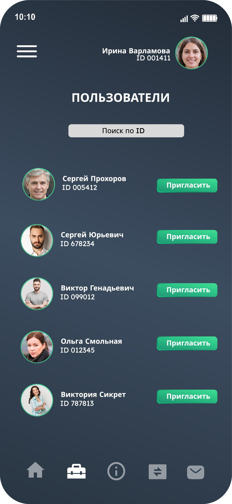

# BookMe_Frontend

## Оглавление

1. [Введение](#введение)
2. [Роли](#роли:)
3. [Технологии](#технологии:)
4. [Участники проекта](#участники-проекта:)
5. [Авторизация/Регистрация](#авторизация/Регистрация)
6. [Роль Пользователь](#роль-пользователь)
    - [Календарь](#календарь)
    - [Опция "Пригласить"](#опция-пригласить)
7. [Роль Гость](#роль-гость)
    - [Просмотр приглашений](#просмотр-приглашений)
    - [Мои брони](#мои-брони)
8. [Поиск пользователей](#поиск-пользователей)
9. [Личный кабинет](#личный-кабинет)

# Введение
Проект, который помогает договариваться о встречах **быстро** и **без лишних ожиданий** от собеседника.

В этом приложении вы можете:
1. Создавать тайм-слоты, которые вы готовы выделить для гостя.
2. Отправлять эти тайм-слоты гостю.
3. Гость выбирает наиболее удобный вариант.
4. Вы получаете уведомление о выборе гостем времени.
5. Тайм-слот автоматически бронируется в вашем календаре.

## Роли:
1. **_Пользователь_** - тот, кто приглашает.
2. **_Гость_** - тот, кто принимает приглашение.

`P.S
Роли представленны для удобства. Фактического распределения ролей в слое авторизации нет`

## Технологии:
- Dart/Flutter (Frontend)
- Java / SpringBoot (Backend)
- Spring Security (Backend)
- Keycloak для авторизации (Backend)
- PostgreSQL
- Liquibase
- Docker
- Kafka для сообщений между сервисами
- SMTP для отправки пригласительных писем

## Участники проекта:
- [Владимир Сорокин](https://t.me/customidze) - **Frontend**
- [Айчурок Ибраимова](https://t.me/aichurok_i) - **Frontend**
- [Семенов Филипп](https://t.me/semenovfilipp) - **Backend**

_____
### Авторизация/Регистрация

#### Авторизация
- Проверка пользователя осуществляется по email.
- Каждый пользователь получает JWT токен после авторизации.
- Все запросы к API проходят через токен, который проверяется на стороне Java.

 <!-- Фото -->

#### Регистрация
- Регистрация происходит по email.
- После регистрации пользователь получает письмо с подтверждением.
- Для безопасности запроса токен проверяется при каждом запросе и может быть обновлен.
  

_____
# Роль Пользователь
## Календарь

Каждый пользователь имеет свой собственный календарь. В нем представлены тайм-слоты с интервалом в 1 час. В текущей версии **MVP** календарь охватывает период с 10:00 до 20:00.

### Тайм-слоты

Каждый тайм-слот может находиться в двух состояниях:

- **Забронирован** (отображается красным цветом)
- **Свободен** (отображается зеленым цветом)

### Месяц

В режиме просмотра месяца показываются числа текущего месяца. Каждое число отображает количество забронированных тайм-слотов в виде маленьких квадратиков.

### Неделя

В режиме просмотра недели показываются дни текущей недели. Каждый день показывает количество забронированных тайм-слотов.

### День

В режиме просмотра дня отображаются все тайм-слоты текущего дня. Занятые тайм-слоты отмечены пользователем, который их забронировал. На свободных тайм-слотах имеется опция "Пригласить".

___
## Опция пригласить

Когда пользователь нажимает на тайм-слот, который не занят, появляется опция "Пригласить".
В окне пользователь может выбрать:
- Дату, на которую он хочет пригласить гостя.
- Свободные тайм-слоты в дате, на которую он хочет пригласить гостя.

На данный момент в варианте **_MVP_** пригласить пользователя можно только по его ID.

______
# Роль Гость
## Просмотр приглашений

Гость может просматривать свои приглашения, то есть те события на которые **пригласили его**.

При переходе по приглашению предлагается выбор:
- Принять приглашение.
- Выбрать тайм-слот
- Посмотртеть кто пригласил
- Посмотрть на какую дату приглашение

При принятии приглашения происходит визуальная индикация для гостя - выбранный таймслот становится красным.
Далее гостьподтверждает свой выбор. Его бронь отправляется в "Мои брони".
Пользователь который создал приглашение получает уведомление об успешном принятии приглашения.
 

`При отсутсвии выбора отмена приглашения происходит автоматически.
`

____
## Мои брони

Здесь гость может просматривать свои брони, то есть события участие в которых он подтвердил.

_____
# Поиск пользователей

Поиск пользователей будет осуществляться по ID.

_____

# Личный кабинет

В личном кабинете пользователь может изменить свое:
- Фото
- Имя
- Фамилию
- Пароль

